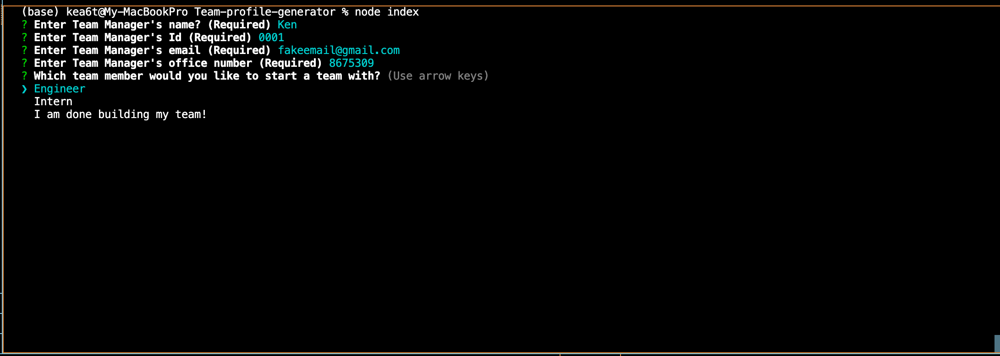

# Team-profile-generator

## Description
Using node.js to generate index.html files using data from user input

Here's a link to the recorded video: https://watch.screencastify.com/v/V0m2WEHNIa233a60NvSx

## Table of Contents
  - [Description](#description)
  - [Table of Contents](#table-of-contents)
  - [User Story](#user-story)
  - [Acceptance Criteria](#acceptance-criteria)
  - [Installation](#installation)
  - [Usage](#usage)
  - [Contributing](#contributing)
  - [Questions](#questions)

## User Story
* AS A manager
* I WANT to generate a webpage that displays my team's basic info
* SO THAT I have quick access to their emails and GitHub profiles
## Acceptance Criteria
* GIVEN a command-line application that accepts user input
* WHEN I am prompted for my team members and their information
* THEN an HTML file is generated that displays a nicely formatted team roster based on user input
* WHEN I click on an email address in the HTML
* THEN my default email program opens and populates the TO field of the email with the address
* WHEN I click on the GitHub username
* THEN that GitHub profile opens in a new tab
* WHEN I start the application
* THEN I am prompted to enter the team manager's name, employee ID, email address, and office number
* WHEN I enter the team manager's name, employee ID, email address, and office number
* THEN I am presented with a menu with the option to add an engineer or an intern or to finish building my team
* WHEN I select the engineer option
* THEN I am prompted to enter the engineer's name, ID, email, and GitHub username, and I am taken back to the menu
* WHEN I select the intern option
* THEN I am prompted to enter the intern's name, ID, email, and school, and I am taken back to the menu
* WHEN I decide to finish building my team
* THEN I exit the application, and the HTML is generated

## Installation
* Open the command line terminal and go to the proper directory
* Install the dependencies
* Then type npm init
* Then type npm install inquirer@8.2.4

## Usage
* Type the following command to the terminal and follow through the questions
node index.js or node index

## Contributing
:octocat: [kea6t](https://github.com/kea6t)

This was generated with ❤️ made by Kenny 🔥🌌🌳🦝

## Questions
If you have any questions :grey_question:, please send me an email at: :e-mail: Email me with any questions: k@gmail.com
